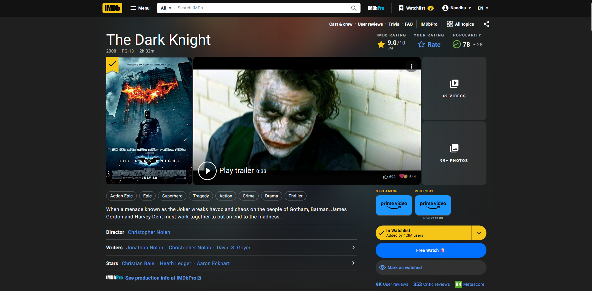
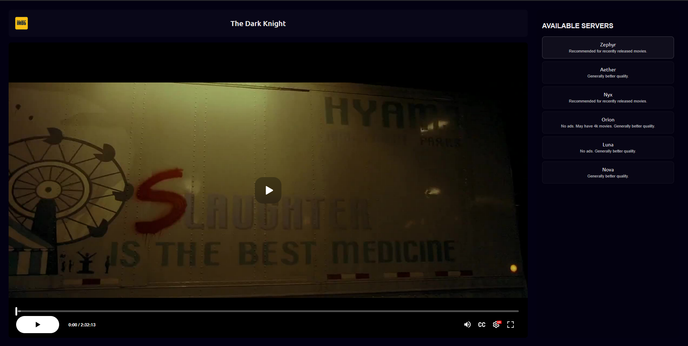
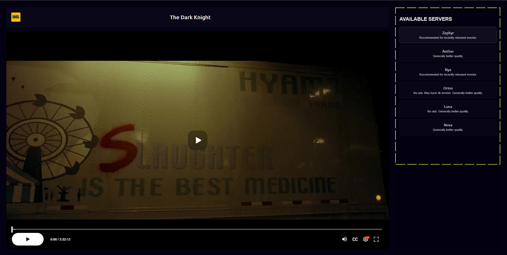
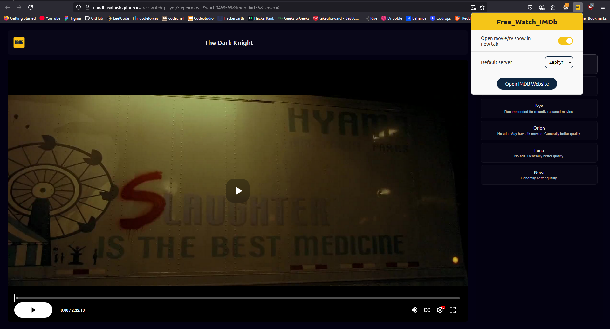

# FreeWatchIMDb

  

## Introduction

FreeWatchIMDb is a browser extension designed to enhance your IMDb experience. By installing this extension, you can easily find and watch movies and TV shows available for free directly from their IMDb pages. A convenient "Free Watch🍿" button will appear, allowing you to open a dedicated player in a new tab and start watching.

**Please note:** This extension does not host any content itself. It aggregates links from various external sources. Some of these sources may contain advertisements, so using an ad blocker like  uBlock Origin is highly recommended for a smoother viewing experience.

## Key Features

* **Direct Access:** Adds a "Free Watch🍿" button on movie and TV show detail pages on IMDb.
* **Multiple Server Options:** The player interface lets you switch between different servers to find a working stream.
* **Free Content Aggregation:** Provides access to free movies and TV shows available on the internet.

## Installation

You can install FreeWatchIMDb in two ways:

**1. Install from the Firefox Add-ons Store:**

* This is the recommended and easiest method.
* Simply search for "FreeWatchIMDb" in the Firefox Add-ons store and click "Add to Firefox".
* Follow the on-screen instructions to complete the installation.
  
  

**2. Install from the .xpi File (for advanced users):**

* Download the `.xpi` file from the [Releases](Link to your releases page here if you have one) section of this repository (or wherever you are distributing the file).
* Open Firefox.
* In the Firefox address bar, type `about:addons` and press Enter. This will open the Add-ons Manager page.
* Drag and drop the downloaded `.xpi` file onto the Add-ons Manager page.
* Alternatively, click on the gear icon at the top right of the Add-ons Manager page and select "Install Add-on from File...". Then, browse to the location where you saved the `.xpi` file and select it.
* Firefox will prompt you to confirm the installation. Click "Add" to install the extension.

## How to Use

1.  **Navigate to IMDb:** Open the IMDb website ([https://www.imdb.com/](https://www.imdb.com/)).

2.  **Browse to a Movie or TV Show:** Find the movie or TV show you want to watch and go to its detail page (e.g., the page with the title, rating, cast, etc.). You should see the "Free Watch🍿" button.

    

3.  **Locate the "Free Watch🍿" Button:** On the movie/TV show detail page, you will now see a new button labeled "Free Watch🍿". This button is usually located near the other action buttons like "Add to Watchlist".

4.  **Click "Free Watch🍿":** Clicking this button will open a new tab with the configured player.

    

5.  **Watch and Enjoy:** In the new tab, the player interface will load. You can then select a server from the available options and start watching the movie or TV show.

    

6.  **Change Servers:** If one server is not working or has too many ads, you can usually find options within the player interface to switch to a different server.

## Configuration

You can configure the extension by clicking on its icon in your browser's toolbar. The popup allows you to:

* **Select Default server:** Choose your preferred server from a list of available options. This will be the player that opens when you click the "Free Watch🍿" button.

    

## Disclaimer

* This browser extension does not host any of the content it provides access to.
* It aggregates links from various third-party sources available on the internet.
* The availability and quality of streams may vary depending on the server you choose.
* Some servers may contain advertisements. Using an ad blocker like uBlock Origin is highly recommended for a better viewing experience.
* The developer of this extension is not responsible for the content provided by third-party servers.
* Please be aware of and comply with the copyright laws of your region when accessing content through this extension.

## Contributing

Looking for enthusiastic contributors to help improve FreeWatchIMDb! Feel free to submit pull requests, report bugs, or suggest new features.

## License

MIT
